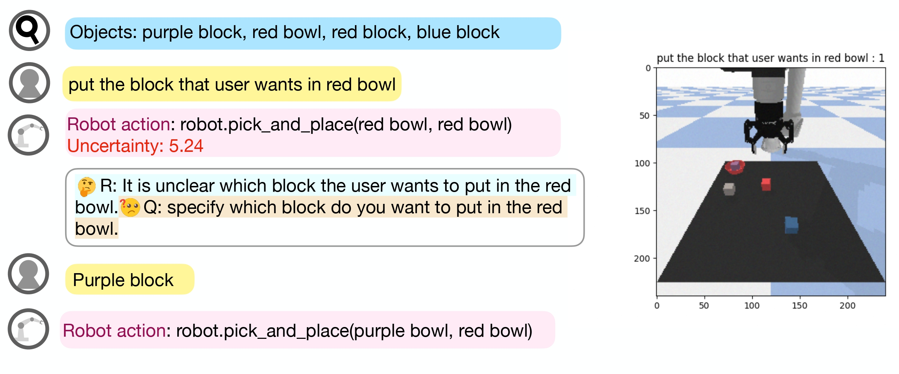

## CLARA-PnP environment experiment
The project page is here [Project](https://clararobot.github.io/)



The Demo code can be runed in
[](https://colab.research.google.com/github/jeongeun980906/CLARA-PNP-DEMO/blob/master/DEMO_colab.ipynb)

## Acknowledgements

This file includes a portion of code derived from:

- **Author(s):** Google LLC
- **Copyright:** 2022 Google LLC
- **License:** [Apache License, Version 2.0](https://www.apache.org/licenses/LICENSE-2.0)
- **Source Code:** https://github.com/google-research/google-research/blob/master/saycan/SayCan-Robot-Pick-Place.ipynb
- **Modification Date:** 2023-10-03
- **Description:** Extracted environment, vision, and language based policy part to adjust to our proejct. 

## Run code
### 0. Run Vision (Optional)
```
python collect_vision_only.py
```
### 1. RUN LLM
```
python test.py --method 2 --lm chat
```

### 2. Val on Language Domain
```
python val_language.py --method 2 --lm chat
```
Please edit success annotation for ood task!
### 3. Run CLIPORT
```
python val_policy.py --method 2 --lm chat
```
Please edit poicy success annotation for ood task!
### 4. Question Generation
```
python test_inter.py --method 2 --lm chat --first
```

### 5. Label
On json file
"answer" :["your answer here"]

### 6. Regeneration
```
python test_inter.py --method 2 --lm chat --last
```


